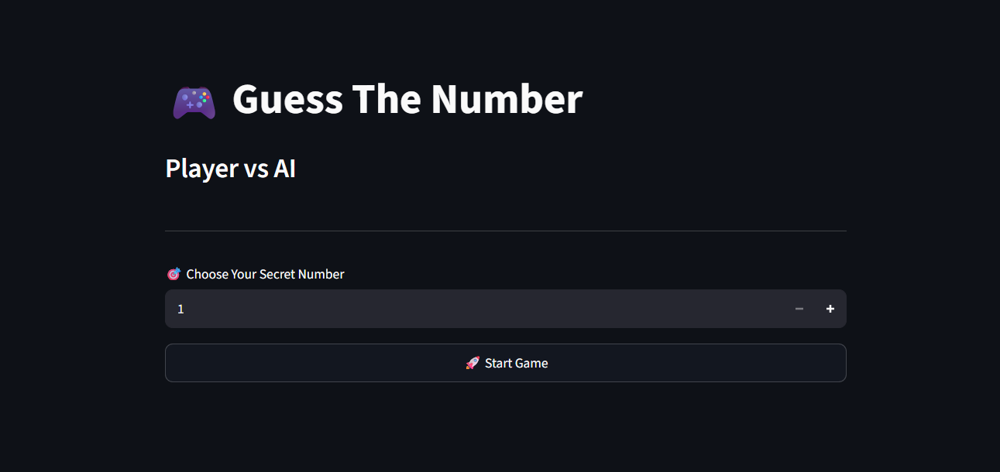
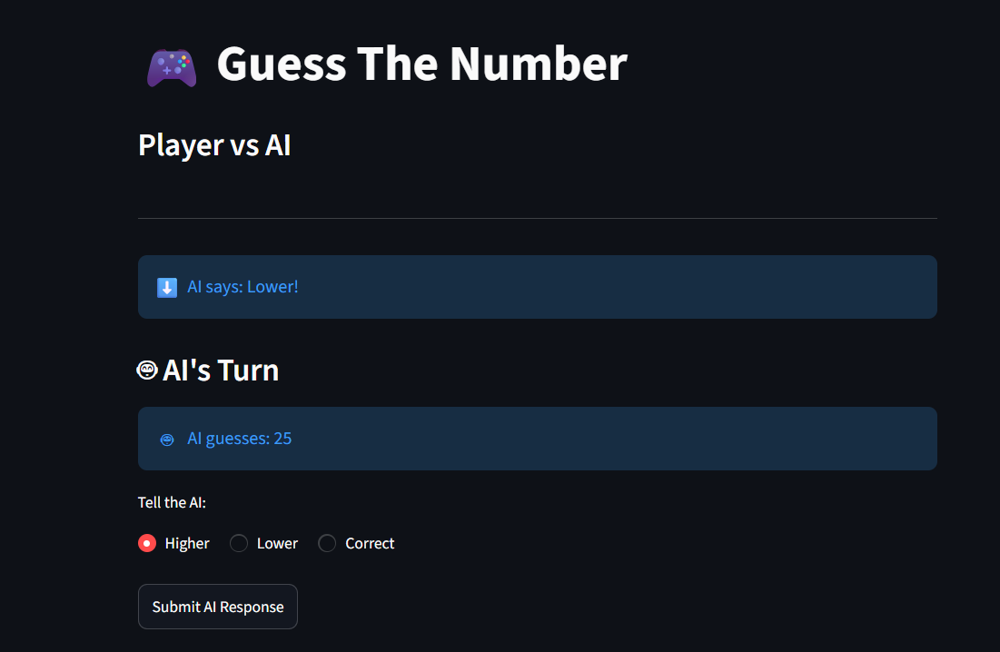
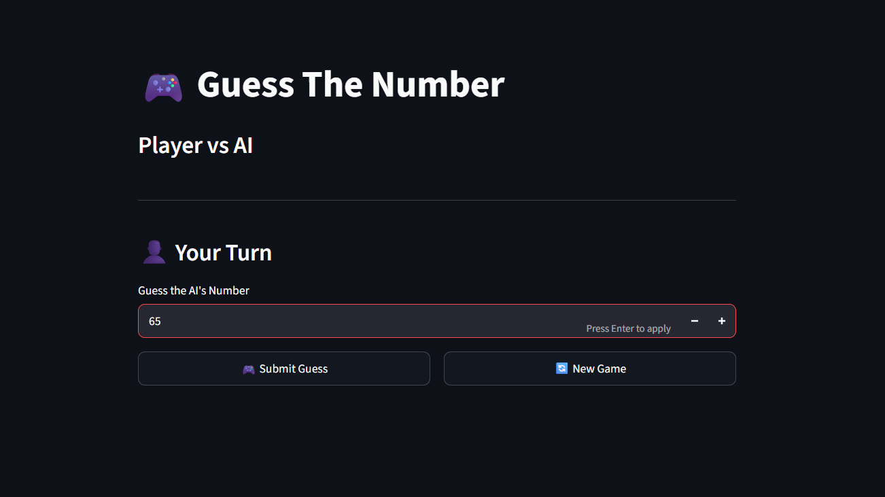
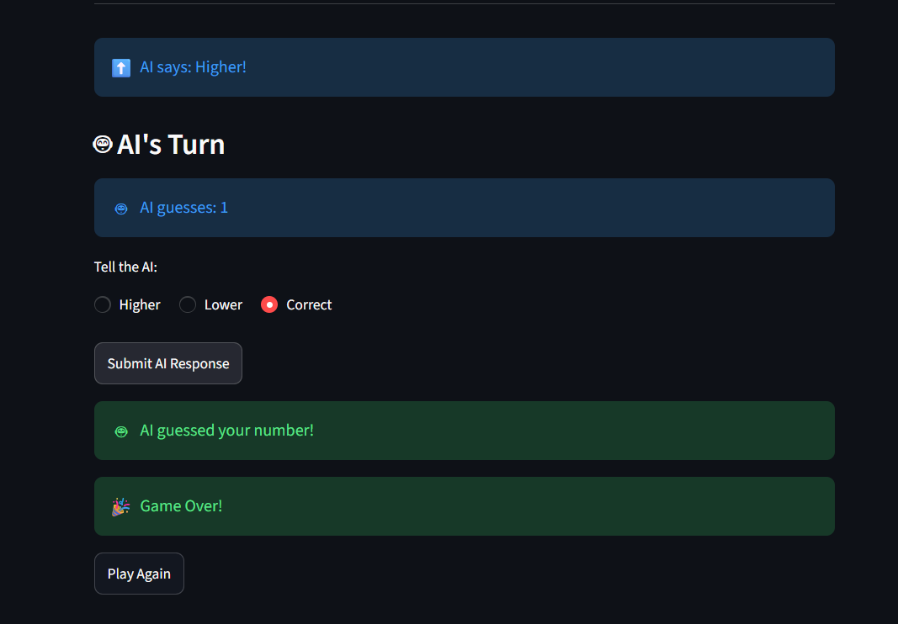

# 🎮 Guess The Number

> A turn-based battle of wits between you and an AI opponent.

🚀 **Live Demo:** https://guessthenumber-upmsdbgvmk4a2nw8vua9zj.streamlit.app/

## ✨ Features

- 🤖 Smart AI powered by Binary Search
- 🎯 Player vs AI gameplay
- 🔄 Automatic turn switching
- 🎉 Interactive Streamlit UI
- 🌐 Live web deployment

## 🛠 Tech Stack

Python • Streamlit • Git • GitHub

## 🧠 AI Logic

The AI uses Binary Search to find your number in the fewest possible guesses.

## 🚀 Run Locally

```bash
pip install -r requirements.txt
streamlit run app.py
```

## 📸 Preview

### Start Screen


### AI Turn


### Player Turn


### Winner Screen
